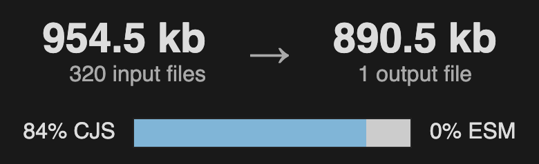

# Treeshaking and ESM

With increasing support of ESM in Typescript [1] and NodeJS [2], it becomes easier and easier to write your frontend or backed in ESM format.
It has better support for treeshaking when using esbuild [3] or webpack [4] and with complexity rising of your backend and frontend it is more then ever important to look at your bundle sizes. 
Even just recently AWS has announced that everyone, not just people using custom runtime environment, have to pay for the INIT Duration [5], making it also cost effective to have your AWS Lambda functions as small as possible.

I want to bring you through my journey of understanding difference between CommonJS and ESM and why it allows for better treeshaking. 
Looking at which typescript config rules and eslint rule might help to reduce it even further. 
Looking at what does get removed when treeshaking and what does not and why.
But most importantly regardless of which tips I give here and which ones you read in other posts: how you can measure the bundle size so you can iteratively decrease it.

## Table of Contents

1. [Module System](#module-system)
2. [Measuring](#measuring)
3. [CJS to ESM](#cjs-to-esm)
4. [CJS vs ESM](#cjs-vs-esm)
5. [Proper Imports](#proper-imports)
6. [Barrel Files](#barrel-files)

## TLDR;

* Set `module` and `moduleResolution` in your TS Config to `nodenext`
* Use `.mts` as file extensions or set `type` to `module` in your nearest `package.json`
* Avoid barrel files or set `sideEffects` to `false` in your nearest `package.json`
* Set `@typescript-eslint/no-unused-vars` to `error`
* Set `@typescript-eslint/consistent-type-imports` to `error`
* Update your webpack/esbuild config to also read `module` entry of your npm packages 

## Module System
To able to use functions or classes written in one file in another file, requires a way of telling how the files should be linked.
In the days of gulp/grunt and jquery there was not much choice, we all wrote everything on the `window` object.
Everything was accessible by everyone. We had to use closures to isolate `var` variables from another and prevent naming collisions.
It was basically just one large JavaScript file.
Quite the nightmare.

### CommonJS
Luckily people quickly started writing systems to separate them, not only at when you are writing your code but also at runtime.
One of the first one and one that still lives to today is CommonJS. Everyone writing NodeJS is probably already familiar with this syntax:

```javascript
const axios = require('axios');

function getHelloWorld() {
    return axios.get('https://hello.world');
}

module.exports = {
    getHelloWorld,
};
```

The fact that everyone was loaded synchronously, which was not really an issue at that time when writing for servers, it was not really feasible for front-ends.
Therefore RequireJS was brought to live. If you ever wondered how it looks, there is an example repository still living [6]. If you are more interested in the history, look up: AMD, UMD, RequireJS.

_Small note: I also believe people just wanted to write to own module system, who can blame their enthusiasm. It was a create module system_

The problem with CommonJS is that the `require` function is a function.
That means the following is valid:

```javascript
const fs = require("fs");
const fs1 = require("f" + "s");
const fs2 = require(`${"f"}s`);
const fs3 = require(["f", "s"].join(""));
const modules = { fs: require("fs") };
const fs4 = modules["fs"];

function getFS() {
  function reallyGetIt() {
    return require("fs");
  }
  return reallyGetIt();
}
const fs6 = getFS();

const allTheSame = [fs, fs1, fs2, fs3, fs4, fs6].every((fsModule) => fsModule === require('fs'));
console.log(allTheSame); // true
```
_Please do not do this_

This is also why your javascript file is executed when referenced, because NodeJS has to know what it has to import.
That is the largest reason why esbuild or webpack can not treeshake properly. 
Because it can not do any static analysis to create a tree of how your program is linked together.
The same principle applies when using `module.exports`. 
Where ever you can use an object, you can export your function or variable.

Another reason CommonJS makes it hard but not impossible, is the freedom of how you reference other files or packages.
Given the following code:
```javascript
require('../libs/manager');
```
This could either be a `../libs/manager.js` file or `../libs/manager/index.js` or `../libs/manager/package.json`.
This freedom was quite useful in the early days of NPM, but it adds too much ambiguity for the developers.
There are more "quirks" to CommonJS, if you are interested in more details, a good start would be NodeJS documentation itself [7](https://nodejs.org/api/modules.html).

### ESM
`require` Is not defined within [EcmaScript](https://tc39.es/ecma262/), it is not natively implemented by any browser.
It is something of NodeJS itself. The same applies for the AMD, UMD and System module syntax.
EcmaScript was behind the ecosystem, but that was a great plus because it could look at all the existing module system and draft a better one.
Entering ESM. It has similar syntax to what Typescript does:

```typescript
import fs from 'fs';

export function readRootPackage() {
    return fs.readFileSync('./package.json', 'utf-8');
}
```

There is no way to tell if this is ESM or Typescript without looking at the file extension.
This also adds to confusion for developers that they are not sure if this will get compiled to a `require` or the native EcmaScript `import` operator.
The only way you know for sure what the output would be, is by compiling it.

What makes ESM so great that it allows treeshaking? The `import` is a operator.  
Meaning that other rules apply compared to `require` function of NodeJS.
The most important rule is that it only allows static strings:

```javascript
import fs from 'fs';
import fs1 from 'f' + 's'; // error
import fs2 from ['f' + 's'].join(''); // error
import fs3 from `${"f"}s`; // error

async function getFS() {
    return await import('fs'); // allowed
}
```

This allows anyone to perform static analysis and build a tree of how the program is linked together.
Furthermore to prevent ambiguity you either reference a package or a file.
That is why the file extensions is required.
This is also where people get confused when they are writing typescript but they have to use `.js` file extensions, luckily this is fixed by using `nodenext` as `moduleResolution`.

## Measuring
Befor we dive in to how much difference it makes between CJS and ESM and how you can transition.
It is useful to know how you can measure it.

webpack And esbuild both support emitting a metafile, which contains data which npm packages are imported, why they are imported and which module system is used to import them.
With webpack you can use the `--profile` [flag](https://webpack.js.org/configuration/other-options/#profile).
With esbuild you can use the `--metafile=bundle.meta.json` [flag](https://esbuild.github.io/api/#build-metadata) or the property `{meta: true}` that will return the json object containg the meta data, which you can write to the file system yourself.
You can submit the meta file to https://esbuild.github.io/analyze/ and then you will get a visual representation on how everything is bundled.
You can let it mark visually which packages are intepretted as CommonJS and which ones as ESM.
This will give you the knowledge if you imported them correctly and if esbuild was able to find the ESM bundle of the npm package.

## CJS to ESM
To show you the difference, I have created 2 projects, both have similar code but one is written for [CommonJS](https://github.com/Pouja/configuring-esm/tree/main/ts-cjs) and the other for [ESM](https://github.com/Pouja/configuring-esm/tree/main/ts-esm).
You can clone the repository and play with the different ways of importing a file and see what impact it will make.
This should also help you transitioning to ESM by looking at the differences.
I believe more in learning by doing and learning by reading.
So I hope this helps for you.

### esbuild
Both repository contain a `esbuild.config.(m)js` file.
Depending on your project, this configuration is either generated or hidden from you.
The most important configurations are:
```javascript
{
    bundle: true,
    mainFields: ["module", "main"], // Tells which package.json entries it should look for
    platform: "node", // Tells if it should expect window object to be present, or the NodeJS internal packages
    format: "esm", // Tells if the output should be in ESM format or in CommonJS
    metafile: true, // If true, it will return a meta file object
    tsconfig: 'tsconfig.json' // It only reads some properties from the tsconfig, see also TsconfigRaw in main.d.ts of esbuild
}
```

esbuild Has its own transpiler, so that is why only some properties are read from the tsconfig.
But the exception is when you use a plugin like esbuild-decorator, which does use all the settings from your tsconfig.
So you can not just configure your tsconfig to use CommonJS and then tell esbuild to output in ESM, you will most likely get some runtime errors.

The `mainFields` property is quite important.
Only a few modern libraries now output properly.
By properly I mean using the `exports` field in the package.json, to tell NodeJS module resolver which file it should read depending on if you are using ESM or CommonJS.
If we take a look at a part of the package.json of `class-validator`:
```json
{
  "name": "class-validator",
  "sideEffects": false,
  "main": "./cjs/index.js",
  "module": "./esm5/index.js",
  "es2015": "./esm2015/index.js",
  "typings": "./types/index.d.ts",
}
```
NodeJS will by default only look at the `exports` field and if that is not present, which is the case for class-validator, it will use the `main` field.
So even if you do this:
```javascript
// index.mjs
import { validate } from 'class-validator';
```
NodeJS will look at `node_modules/class-validator/cjs/index.js` even though your file is in `.mjs` format and even if your package.json you have set `type` to `module`.
You can still tell esbuild to use the ESM output of class-validator by setting the `mainFields` property.

Use this information!
When inspecting and investigating your imports and you notice it uses the CommonJS variant of the package, even when they have ESM files.
Look at their package.json! If they do not emit any ESM file, your only options are: submitting a pull request or copy the code to your code base.

### package.json
The property `type` in the package.json is set to `module` for the ESM project and omitted CommonJS project, which defaults to `commonjs`.
You can actually choose how you will mark your project as ESM or CommonJS. 
When using plain javascript, you either use the `.mjs` extension for your files or you set the `type` property in the nearest package.json.
You can mix. You are allowed to use CommonJS files in ESM files, but not the other way around.

If you are using CommonJS and you need to use a package that only has ESM files, you can use the following "hack":
```javascript
function myFunc() {
  const dynamicImport = new Function('specifier', 'return import(specifier)');
  const TypeDoc = await dynamicImport('typedoc');
}
```

### tsconfig.json
This is the most confusing part.
I really had to read throug the [module page](https://www.typescriptlang.org/docs/handbook/modules/reference.html) of typescript couple of times to understand what they are saying.
The most important configurations for transition of CJS to ESM are:
```json
{
    "compileOnSave": true,
    "compilerOptions": {
        "moduleResolution": "nodenext", // this tells typescript which algorith/method it should use to resolve imports
        "module": "NodeNext", // This tells if you are using CommonJS, AMD, System, ESM or a mix of CommonJS and ESM which is nodenext
        "target": "ESNext", // This tells how the output should look like after you have compiled to javascript
    },
}
```

`nodenext` basically means that typescript will either resolve the imports by using NodeJS CommonJS module resolution technique or using the new ESM module resolution technique.
And it depends on the file extensions, using `.mts` will tell `typescript` to use ESM.
If you use `.ts` but the package.json has the property `type` set to `module` it will use ESM.
In all other cases it will use CommonJS.
Although typescript is quite lenient since 5.8.x on which module system it will use, it best to be consistent.
Do not mix. You will get unexpected results when using frameworks that are consistent.

You can also set `moduleResolution` to `bundler`, but then you have to specify to which specific module system you want your javascript files compiled to.
Then it does not matter what file extension you use, it will always output to what ever module system you have picked.

When using `nodenext` value you can still output to both CommonJS format and ESM format, you only need to change the `format` property in esbuild and you have to make sure to not set the `type` property in the package.json file.

If you are not intending on publishing and if all your libraries/framework support ESM, which Jest does poorly right now, I would recommend to setting the `type` property to `module` and use the `.mts` file extension.
You will notice  that you have to use `.mjs` when importing a relative file.
Do not worry, you are not importing a javascript file, Typescript will automatically search for any `.mts` file with the same module name.
It is confusing, people have complained about this behavior, but it is what it is.


## CJS vs ESM
Now you know how you can transition, but how much will the difference be?

CommonJS:



ESM:


It is 20x smaller when using the same code.
If you generate the metafiles and upload it to esbuild page, you can reproduce this result.
You will notice that the biggest difference comes from libphonenumber-js not being present,
because due to ESM, esbuild knows it can remove it from the end result safely.

## Proper Imports
Even when using CommonJS you can reduce your bundle size by looking at the import statements

Use `import type { MyClass} from './MyClass';` or `import { type MyClass} from './MyClass';` if you only use the import as a type.
Using [@typescript-eslint/consistent-type-imports](https://typescript-eslint.io/rules/consistent-type-imports/) allows you to capture most of them.
This rule will not work on any file that uses decorators.
That is because under the hood the imported value might actually be used when setting the metadata of the decorated property.

Eliminate unused imports by detecting unused variables/functions that might use those.
You can detect those by using [@typescript-eslint/no-unused-vars](https://typescript-eslint.io/rules/no-unused-vars).

## Barrel files
